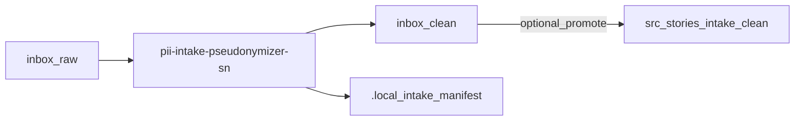

# PII Intake Pseudonymizer (ServiceNow workflow)

Offline PII intake pseudonymizer for ServiceNow-style story monorepos — drop exports in `inbox/raw/`, pseudonymize to `inbox/clean/`, and keep stable tokens via an encrypted map.

[](https://ko-fi.com/alkitect/?hidefeed=true&widget=true&embed=true)

## What this does

It helps you safely process ServiceNow / Jira exports and story docs where PII may be embedded in free text (emails, usernames, org names, IPs, etc.).

It runs `scripts/anonymize_intake.py` on `inbox/raw/` (default), writes pseudonymized output to `inbox/clean/`, and can `--promote` into `src/stories/<STORY-id>/`. Replacements stay stable across runs via an encrypted `./.local/pii-map.json`.

**Safe by default:** use `--summary` on `src/stories/...` paths for detect-only commit gates (no output/map writes), or `--dry-run` for intake. Only run a real pass when you've set your map key.

## Who this is for

- **In:** offline, local PII pseudonymization for ServiceNow/Jira story repos with `inbox/raw` + `src/stories` layout
- **In:** workflows that must keep stable tokenization across multiple runs (same input patterns → same pseudonyms)
- **Not for:** production de-identification pipelines that require formal compliance guarantees

## Quick start

```bash
git clone https://github.com/alkitect/pii-intake-pseudonymizer-sn.git
cd pii-intake-pseudonymizer-sn

./scripts/install-to-local.sh

python -m pip install -r requirements-pii.txt pytest

mkdir -p inbox/raw inbox/clean .local src/stories/STORY-1000/docs

# 1) Detect-only commit gate on story docs (no map key required)
pii-intake-pseudonymizer-sn src/stories/STORY-1000/docs --summary

# 2) Pseudonymize dropped exports (+ optional promote; set key first — see Configure)
#    Copy files into inbox/raw first
pii-intake-pseudonymizer-sn inbox/raw --promote STORY-1000
```

Omit `--promote STORY-1000` if you only need `inbox/clean/`. `--summary` implies `--dry-run` and `--fail-on-hits`.

**What you installed:** wrappers `pii-intake-pseudonymizer-sn` and `verify-pii-intake-pseudonymizer-sn` in `~/.local/bin`.

**Stay safe before enabling:** run `--summary` on a story subtree first; keep `PII_MAP_KEY` secret until you've confirmed outputs look right.

**Needs:**
- Python 3 + `pip`
- No network required at intake time (tool is offline)

## Check it works

Good output means: `verify-pii-intake-pseudonymizer-sn` exits 0.

```bash
verify-pii-intake-pseudonymizer-sn
```

Maintainers: `./scripts/ci-check.sh`.

## Uninstall

```bash
./scripts/uninstall-from-local.sh
```

## Configure

Set the encryption key used for `./.local/pii-map.json`:

- `PII_MAP_KEY` (raw Fernet key)
- `PII_MAP_KEY_FILE` (path to a file containing the Fernet key)

Optional NER extras:
- `requirements-pii-ner.txt` adds Presidio/spaCy; NER is off by default (use `--ner` to opt in).

## How it works



| Piece | Role |
|-------|------|
| `anonymize_intake.py` | CLI: intake, promote, commit gate modes |
| `intake_manifest.py` | Checksum registry for clean outputs |
| `.local/pii-map.json` | Encrypted stable pseudonym store |

Docs: [docs/README.md](docs/README.md) · [Repo layout](docs/repo-layout.md) · [Architecture](docs/architecture/README.md)

## Limits & safety

This tool can rewrite local files if you run it outside `--dry-run` / `--summary` gate modes. Scope:

- **Platform:** offline, local file processing (CLI); defaults to `inbox/raw` → `inbox/clean`
- **Safety model:** CLI pseudonymization + `--summary` commit gates on `src/stories/`; do not point agents or editors at `inbox/raw` without pseudonymizing first
- **Kill-switch:** use `--dry-run` / `--summary` to prevent output/map writes; run `./scripts/uninstall-from-local.sh` to remove installed wrappers
- **Defaults:** `--summary` on `inbox/raw` is refused (intake vs commit gate); real pseudonymization requires an encryption key for saving the map
- **Tradeoffs:** stable tokenization requires a persistent encrypted map; deleting `./.local/pii-map.json` will change pseudonyms

- This GitHub repo is the release source for tagged releases and public docs — see [CONTRIBUTING.md](CONTRIBUTING.md)

**Documentation:** [docs/README.md](docs/README.md) · [Product comparison](docs/product-comparison.md) · generic sibling [pii-intake-pseudonymizer](https://github.com/alkitect/pii-intake-pseudonymizer)

## License

MIT — see [LICENSE](LICENSE).

Optional tip jar: [ko-fi.com/alkitect](https://ko-fi.com/alkitect/?hidefeed=true&widget=true&embed=true)

