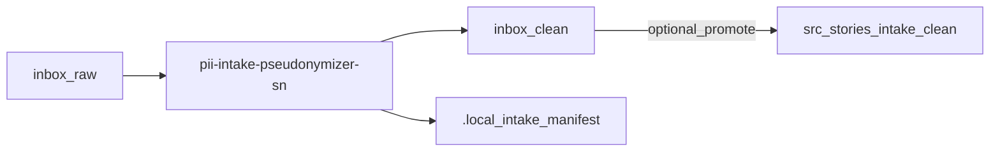

# PII Intake Pseudonymizer (ServiceNow workflow)

Offline PII intake pseudonymizer for ServiceNow-style story monorepos — drop exports in `inbox/raw/`, pseudonymize to `inbox/clean/`, and keep stable tokens via an encrypted map.

[](https://ko-fi.com/alkitect/?hidefeed=true&widget=true&embed=true)

## What this does

It helps you safely process ServiceNow / Jira exports and story docs where PII may be embedded in free text (emails, usernames, org names, IPs, etc.).

It runs `scripts/anonymize_intake.py` on `inbox/raw/` (default), writes pseudonymized output to `inbox/clean/`, and can `--promote` into `src/stories/<STORY-id>/`. Replacements stay stable across runs via an encrypted `./.local/pii-map.json` (pseudonymization — reversible with the key).

**Safe workflow:** start with `--dry-run` on intake or `--summary` on `src/stories/...` (detect-only; no output/map writes). Only run a real write when you have set up a map key ([Configure](#configure)).

## Who this is for

- **In:** offline, local PII pseudonymization for ServiceNow/Jira story repos with `inbox/raw` + `src/stories` layout
- **In:** workflows that must keep stable tokenization across multiple runs (same input patterns → same pseudonyms)
- **Not for:** production de-identification pipelines that require formal compliance guarantees

## Quick start

First run? Follow [docs/getting-started.md](docs/getting-started.md). This block is a cheat sheet.

**Workflow:** quarantine in `inbox/raw/` → intake dry-run → real pass (optional `--promote`) → commit gate on `src/stories/.../docs` before git push.

Install and sample (no map key required):

```bash
git clone https://github.com/alkitect/pii-intake-pseudonymizer-sn.git
cd pii-intake-pseudonymizer-sn

./scripts/install-to-local.sh
python -m pip install -r requirements-pii.txt pytest

mkdir -p inbox/raw inbox/clean .local src/stories/STORY-1000/docs
echo 'Contact jane.doe@example.com for access.' > inbox/raw/sample.txt

# Intake preview (no writes)
pii-intake-pseudonymizer-sn inbox/raw --dry-run

# Commit-gate demo: copy unpseudonymized text into story docs (non-zero exit = hits found)
cp inbox/raw/sample.txt src/stories/STORY-1000/docs/sample.md
pii-intake-pseudonymizer-sn src/stories/STORY-1000/docs --summary
```

Real pass (key required — [Configure](#configure); deletes raw text unless `--keep-raw`):

```bash
python -c "from cryptography.fernet import Fernet; print(Fernet.generate_key().decode())" \
  > ~/.config/servicenow-pii/pii-map.key
chmod 600 ~/.config/servicenow-pii/pii-map.key   # Unix

export PII_MAP_KEY_FILE="$HOME/.config/servicenow-pii/pii-map.key"
pii-intake-pseudonymizer-sn inbox/raw --promote STORY-1000

grep user_001 inbox/clean/sample.txt   # expect user_001@example.test
```

Omit `--promote STORY-1000` if you only need `inbox/clean/`. `--summary` implies `--dry-run` and `--fail-on-hits`.

**Expected tokens:** `jane.doe@example.com` → `user_001@example.test`; display names → `PERSON_001` (see [examples](docs/examples/README.md)).

**What you installed:** wrappers in `~/.local/bin`; scripts + config copied to `~/.local/share/pii-intake-pseudonymizer-sn/`. Re-run `./scripts/install-to-local.sh` after `git pull`.

**Needs:**
- Python 3.10+ and `pip`
- Git Bash or a POSIX shell for `install-to-local.sh` (Windows: Git Bash or WSL)
- Ensure `~/.local/bin` is on your `PATH`
- Text/markdown/XML/JSON exports (`.xlsx`, `.pdf` are skipped — export to text first)
- No network required at intake time (tool is offline)

## Check it works

**Verify install** (runs unit tests from this clone — not your sample file):

```bash
verify-pii-intake-pseudonymizer-sn
```

Exit code 0 means install + dependencies are OK. Non-zero `--summary` when hits are found is **expected** (detect-only gate), not a failed verify.

Maintainers: `bash scripts/ci-check.sh`.

## Uninstall

```bash
./scripts/uninstall-from-local.sh
```

## Configure

Generate a Fernet key once and store it **outside** cloud sync (prefer `PII_MAP_KEY_FILE` over inline `PII_MAP_KEY` — avoids shell history):

```bash
mkdir -p ~/.config/servicenow-pii
python -c "from cryptography.fernet import Fernet; print(Fernet.generate_key().decode())" \
  > ~/.config/servicenow-pii/pii-map.key
chmod 600 ~/.config/servicenow-pii/pii-map.key   # Unix
export PII_MAP_KEY_FILE="$HOME/.config/servicenow-pii/pii-map.key"
```

- `PII_MAP_KEY` — raw Fernet key (avoid in interactive shells)
- `PII_MAP_KEY_FILE` — path to a file containing the Fernet key

Platform defaults if neither env var is set (CLI **auto-loads** if the file already exists):

- Windows: `%LOCALAPPDATA%/ServiceNow-PII/pii-map.key`
- Linux/macOS: `~/.config/servicenow-pii/pii-map.key`

Allowlist, org scrub, and person-field harvest: [docs/configuration.md](docs/configuration.md). Use `--irreversible` when you need ephemeral tokens with no map write for external share.

Optional NER extras:

```bash
python -m pip install -r requirements-pii-ner.txt
pii-intake-pseudonymizer-sn inbox/raw --ner --dry-run
```

NER is off by default (`ner=skipped` without extras).

## How it works



| Piece | Role |
|-------|------|
| `anonymize_intake.py` | CLI: intake, promote, commit gate modes |
| `intake_manifest.py` | Checksum registry for clean outputs |
| `.local/pii-map.json` | Encrypted stable pseudonym store |

Docs: [Getting started](docs/getting-started.md) · [Documentation index](docs/README.md) · [Repo layout](docs/repo-layout.md) · [Architecture](docs/architecture/README.md)

## Limits & safety

This tool can rewrite local files if you run it outside `--dry-run` / `--summary` gate modes. Scope:

- **Platform:** offline, local file processing (CLI); defaults to `inbox/raw` → `inbox/clean`
- **Safety model:** CLI pseudonymization + `--summary` commit gates on `src/stories/`; do not point agents or editors at `inbox/raw` without pseudonymizing first
- **Git hygiene:** keep `inbox/raw/` and `.local/` out of git — only pseudonymized story paths should reach shared remotes ([repo layout](docs/repo-layout.md))
- **Kill-switch:** use `--dry-run` / `--summary` to prevent output/map writes; run `./scripts/uninstall-from-local.sh` to remove installed wrappers
- **Defaults:** `--summary` on `inbox/raw` is refused (intake vs commit gate); default write without `--also-technical` leaves hostnames, paths, commands, and PEM intact
- **Tradeoffs:** stable tokenization requires a persistent encrypted map; deleting `./.local/pii-map.json` will change pseudonyms
- **Infra-heavy exports:** logs, PEM drops, or shell snippets in `inbox/raw/` need **`--also-technical`** on the intake write pass
- **Not a compliance product:** does not scrub git history, binary files, or content pasted into chat before scrubbing — see [Security](docs/security.md)

- This GitHub repo is the release source for tagged releases and public docs — see [CONTRIBUTING.md](CONTRIBUTING.md)

**Documentation:** [docs/README.md](docs/README.md) · [Getting started](docs/getting-started.md) · [Product comparison](docs/product-comparison.md) · generic sibling [pii-intake-pseudonymizer](https://github.com/alkitect/pii-intake-pseudonymizer)

## License

MIT — see [LICENSE](LICENSE).

Optional tip jar: [ko-fi.com/alkitect](https://ko-fi.com/alkitect/?hidefeed=true&widget=true&embed=true)
