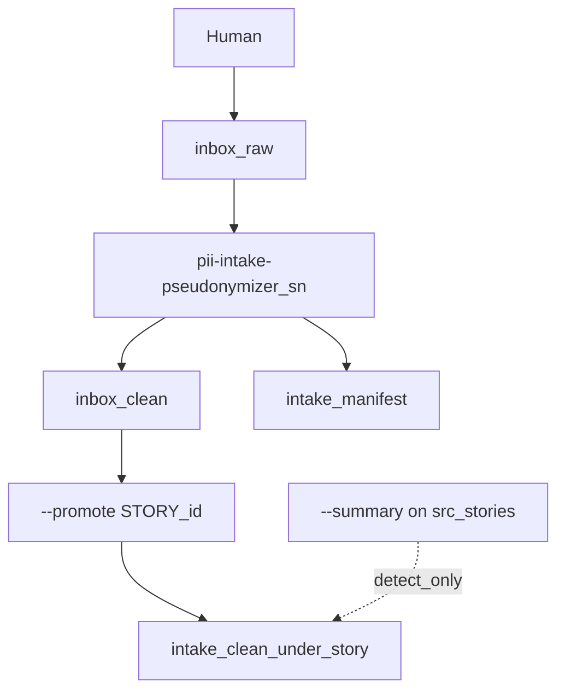

# Architecture (C4 hub)

ServiceNow story-monorepo flavor: quarantine → pseudonymize → optional promote → commit detect-only.

| Level | Doc | Scope |
|-------|-----|-------|
| **C1 Context** | [c1-context.md](c1-context.md) | Actors, exports, story repo |
| **C2 Containers** | [c2-containers.md](c2-containers.md) | CLI, inbox, manifest, map |
| **C3 Components** | [c3-cli-components.md](c3-cli-components.md) | Shared with generic CLI + manifest |

**Decisions:** [decisions/README.md](../decisions/README.md)

## End-to-end flow

## Extra module (SN)

| Module | Role |
|--------|------|
| `scripts/intake_manifest.py` | SHA-256 registry for clean / promoted outputs |

Generic C3 details: [pii-intake-pseudonymizer architecture](https://github.com/alkitect/pii-intake-pseudonymizer/tree/v0.1.0/docs/architecture).
