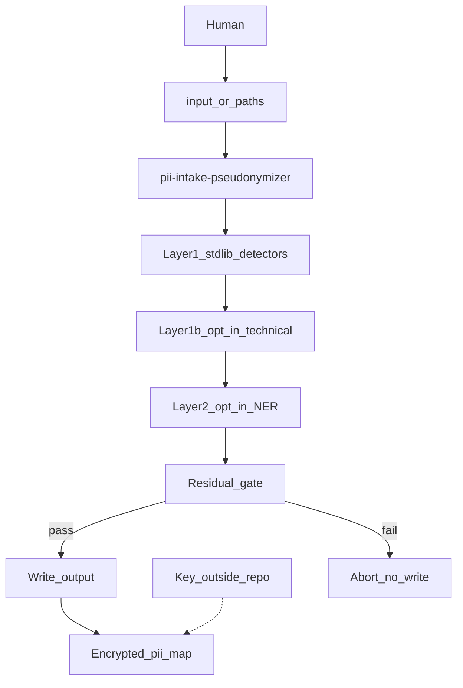

# Architecture (C4 hub)

Local, offline pseudonymization CLI — no network service, no editor dependency.

| Level | Doc | Scope |
|-------|-----|-------|
| **C1 Context** | [c1-context.md](c1-context.md) | Actors, system boundary, external systems |
| **C2 Containers** | [c2-containers.md](c2-containers.md) | CLI, config, map, I/O stores |
| **C3 Components** | [c3-cli-components.md](c3-cli-components.md) | Inside `anonymize_intake.py` |

**Decisions:** [decisions/README.md](../decisions/README.md)

**Operate:** [getting-started.md](../getting-started.md) · [cli-reference.md](../cli-reference.md)

## End-to-end flow (default write)

## Module map

| Module | Role |
|--------|------|
| `scripts/anonymize_intake.py` | CLI entry, modes, staging, residual abort |
| `scripts/pii_detectors.py` | Phones, IBAN, BSN, MAC, postcode, DOB, residual scan; flag-gated machine/path/command/PEM finders |
| `scripts/pii_map_crypto.py` | Fernet encrypt/decrypt, key resolution |
| `scripts/pii_ner.py` | Opt-in Presidio PERSON (`--ner`) |
| `config/*` | Allowlist, org list, person fields, NER config |

View diagrams in GitHub, VS Code, or Cursor Markdown preview (Mermaid enabled).
