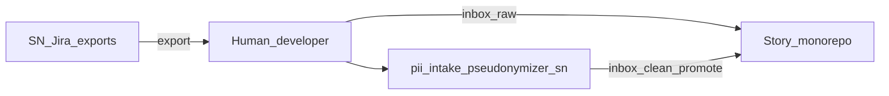

# C1 Context — PII intake pseudonymizer (ServiceNow workflow)

## Overview

Local offline pipeline for **ServiceNow / Jira story monorepos**: quarantine exports in `inbox/raw/`, pseudonymize to `inbox/clean/`, optionally promote into `src/stories/<STORY-id>/`, and run detect-only gates on committed story docs.

Does not modify ServiceNow instance records at runtime.

## System boundary

- **In scope:** `inbox/`, `src/stories/`, `.local/` map + manifest, CLI
- **Out of scope:** Cursor/IDE hooks (not shipped in this public repo); org CI; certified compliance

## Actors

### Human developer

Drops exports into `inbox/raw/`, runs write passes and optional `--promote`, runs `--summary` on story docs before commit, manages encryption key off sync.

### Story repo consumers

Collaborators and CI read pseudonymized `src/stories` content — never raw quarantine.

## External systems

| System | Relationship |
|--------|--------------|
| ServiceNow / Jira | Source of exports; no API calls from this tool |
| Cloud sync | May sync repo; key outside sync; exclude `.local` when possible |

## Context diagram

## Related

- [C2 Containers](c2-containers.md)
- [Repo layout](../repo-layout.md)
- Generic context: [pii-intake-pseudonymizer C1](https://github.com/alkitect/pii-intake-pseudonymizer/blob/v0.1.0/docs/architecture/c1-context.md)
