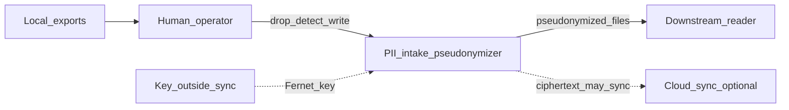

# C1 Context — PII intake pseudonymizer

## Overview

A **local developer-workstation** tool that replaces common identifiers in text files with **stable pseudonyms** before those files are shared, tested, or analyzed further. It runs offline; it does not call ServiceNow or other cloud APIs at runtime.

Mapped tokens (`PERSON_001`, `user_001@example.test`, …) are **pseudonyms**, not anonymous data: a reversible encrypted map exists when you use the default write mode. See [ADR-001](../decisions/ADR-001-pseudonymization-naming-and-detection.md).

## System boundary

- **In scope:** Local text/markdown/XML/JSON/CSV paths; encrypted map under `.local/`; config under `config/`
- **Out of scope:** Certified compliance de-identification; scrubbing git history; cloud redaction APIs; binary document conversion; automatic technical scrub without explicit `--also-*` flags

## Actors

### Human operator

Drops exports into `input/` (or custom paths), manages the map encryption key, runs detect-only scans before writes, optionally enables `--ner`, **`--also-technical`** (or individual `--also-*` flags) for infra-heavy exports, or human-only flags (`--report`, `--irreversible`, `--map-prune-unused`).

### Downstream consumer

Reads pseudonymized files from `output/` (or custom `--out`). Must not receive the map key if re-identification must remain impossible.

## External systems

| System | Relationship |
|--------|--------------|
| Source applications (ServiceNow, Jira, mail) | Export files **out**; this tool only sees local copies |
| Cloud sync (OneDrive, etc.) | May sync project tree; **key must stay outside** sync root; see [Security](../security.md) |
| Optional NER models (Presidio/spaCy) | Installed locally when `--ner` is used |

## Context diagram

## Related

- [C2 Containers](c2-containers.md)
- [C3 CLI components](c3-cli-components.md)
