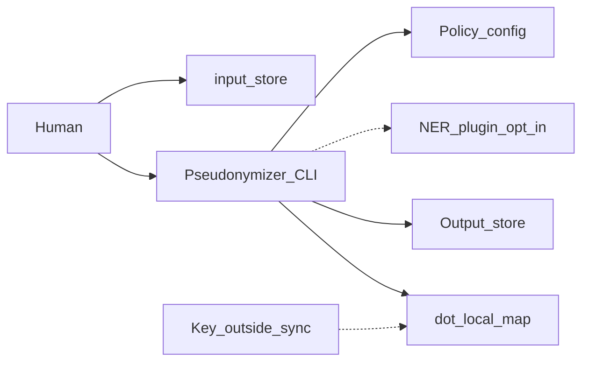

# C2 Containers — PII intake pseudonymizer

## Overview

Deployable boundaries on a single machine. No network port; “containers” are the **CLI process**, **optional NER plugin**, **config policy files**, and **on-disk stores**.

## Technology

- Python 3 CLI
- Base dependency: PyCA `cryptography` (`requirements-pii.txt`)
- Optional: Presidio + spaCy (`requirements-pii-ner.txt`) when `--ner` is on

## Containers

### Pseudonymizer CLI

- **Package:** `scripts/anonymize_intake.py` (+ detectors, map crypto, optional NER)
- **Responsibilities:** Tokenize text (Layer 1 + optional Layer 1b technical flags); residual fail-closed before write; encrypted map; default agent-safe stdout; optional `--summary` detect-only
- **Data:** Source text, encrypted map, written output tree

### NER plugin (opt-in)

- **Package:** `scripts/pii_ner.py`, `config/pii-ner.json`
- **Responsibilities:** Free-text PERSON via Presidio when `--ner` and extras are present
- **Default:** off; reports `ner=skipped` when extras absent

### Policy config

- **Package:** `config/pii-allowlist.txt`, `pii-org-scrub.txt`, `pii-person-fields.json`
- **Purpose:** Functional allowlist; org name scrub list; structured person-field harvest rules

### Input store

- **Default:** `input/` (or any path passed on the command line)
- **Role:** Source files before pseudonymization

### Output store

- **Default:** `output/` mirror of relative paths
- **Role:** Pseudonymized artifacts for downstream use

### Local ciphertext (`.local/`)

- **Files:** `pii-map.json` (encrypted), optional `pii-map-audit.jsonl`
- **Role:** Reversible token store; may include `machines`, `paths`, `commands`, and `certs` map stores when technical flags are used; never commit

### Map key store (outside sync)

- **Resolution:** `PII_MAP_KEY`, `PII_MAP_KEY_FILE`, or platform default under `%LOCALAPPDATA%/ServiceNow-PII/` / `~/.config/servicenow-pii/`
- **Rule:** Key file must not live next to the map under a cloud-synced repo root

## Container diagram

## Relationships

| From | To | Purpose |
|------|-----|---------|
| Human | CLI | Run detect-only or write passes |
| CLI | Input / output | Read sources; write pseudonymized mirror |
| CLI | `.local/` | Encrypted map read/write on mutating passes |
| CLI | Key store | Encrypt/decrypt map |
| CLI | NER plugin | Optional Layer 2 PERSON (only when `--ner`) |

## Related

- [C1 Context](c1-context.md)
- [C3 CLI components](c3-cli-components.md)
- [ADR-002 Map encryption](../decisions/ADR-002-map-encryption-key-separation.md)
