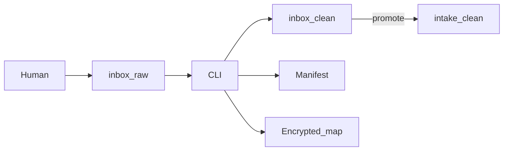

# C2 Containers — ServiceNow workflow

Extends the [generic C2 containers](https://github.com/alkitect/pii-intake-pseudonymizer/blob/v0.1.0/docs/architecture/c2-containers.md) with inbox layout and manifest.

## Additional containers

### Quarantine (`inbox/raw`)

Gitignored drop zone. Successful text writes delete scrubbed raw files unless `--keep-raw`. Binaries skipped.

### Staging (`inbox/clean`)

This-run output only. Pruned after write; cleared after `--promote` unless `--keep-clean`.

### Story intake-clean

`src/stories/<STORY-id>/intake-clean/` — durable copy after `--promote`.

### Intake manifest (`.local/intake-manifest.json`)

SHA-256 registry written by `intake_manifest.py` after successful pseudonymize / promote.

## Container diagram

## Mode split

| Mode | Path | Purpose |
|------|------|---------|
| Intake write | `inbox/raw` | Pseudonymize quarantine |
| Commit gate | `src/stories/...` | `--summary` detect-only |

See [ADR-004](../decisions/ADR-004-intake-vs-commit-gate.md).

## Related

- [C1 Context](c1-context.md)
- [C3 CLI components](c3-cli-components.md)
