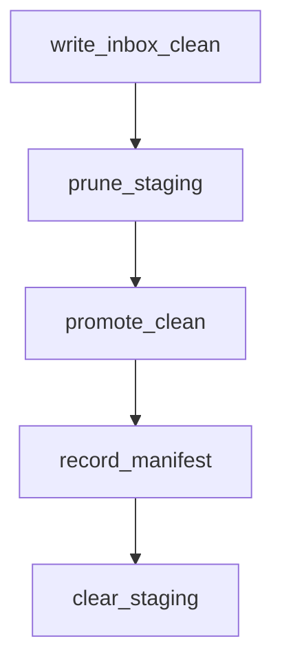

# C3 Components — CLI + manifest

Core pipeline matches [generic C3](https://github.com/alkitect/pii-intake-pseudonymizer/blob/v0.1.0/docs/architecture/c3-cli-components.md).

## ServiceNow additions

### Staging manager (inbox/clean)

- Prune leftovers before `--promote`
- Clear staging after promote
- `--keep-clean` skips prune/clear

### Promote

`copytree` from `inbox/clean/` → `src/stories/<STORY-id>/intake-clean/`, then drop inbox clean keys from manifest.

### Manifest recorder (`intake_manifest.py`)

Records sha256 of written clean files and promoted trees for workflow verification.

## Related

- [CLI reference](../cli-reference.md)
- [Commit gate](../commit-gate.md)
