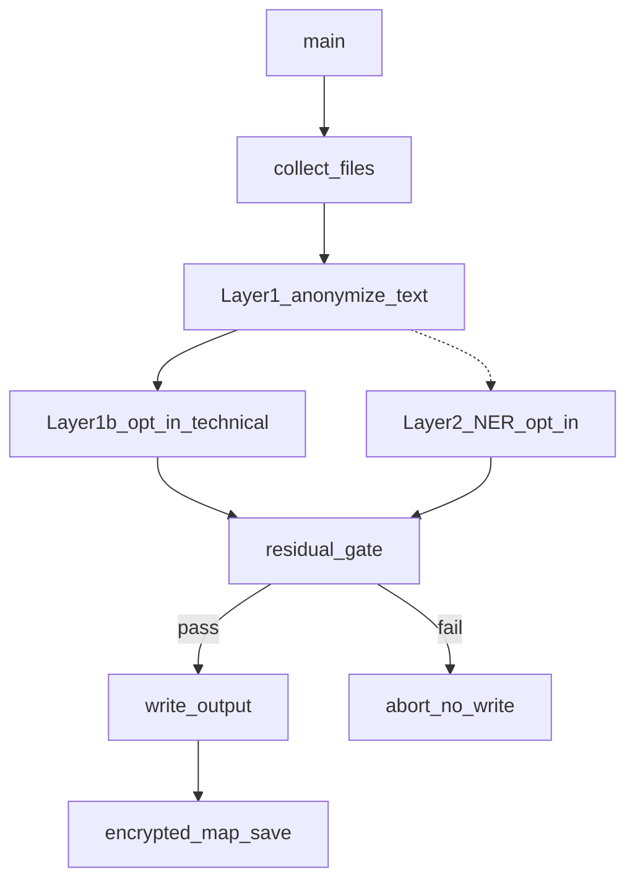

# C3 Components — Pseudonymizer CLI (`anonymize_intake`)

Internal structure of the pseudonymizer CLI (C2 container). Entry: `scripts/anonymize_intake.py`.

## Components

### Path collector

Walks target paths; skips export-archive path segments; counts binary skips (`.xlsx`, `.pdf`, …).

### Layer 1 tokenizers

In-memory replace using teaching-stable `PiiMap` pseudonyms:

- Emails → `user_NNN@example.test`
- Harvested person fields from XML/JSON/CSV config
- Phones, checksum IBAN, optional BSN/IP/MAC/postcode/DOB
- Org names from `pii-org-scrub.txt` when enabled

**Code:** `anonymize_text`, `pii_detectors.py`

### Layer 1b — opt-in technical (default off)

Step **5b** in `anonymize_text()` — runs only when `--also-machines`, `--also-paths`, `--also-commands`, `--also-certificates`, or the **`--also-technical`** bundle is set. Order: certificates → paths → commands → labeled machines.

- PEM blocks → `CERT_NNN`
- Absolute paths → `PATH_NNN`
- Command-like whole lines → `CMD_NNN`
- Labeled hostname/machine fields → `MACHINE_NNN`

Technical categories are **not** in the high-confidence residual fail-write gate (email + checksum IBAN).

**Code:** `anonymize_text` step 5b, `pii_detectors.py` finders

### Layer 2 NER (opt-in)

Presidio PERSON spans when `--ner` and `requirements-pii-ner.txt` are present. Default off.

**Code:** `pii_ner.py`

### Residual gate

Abort **before** write / map save on high-confidence leftovers (non-allowlisted email, checksum-valid IBAN). Warn-only for several other categories.

### Map crypto + `PiiMap`

Fernet-encrypted map at rest; `--map-migrate` / `--map-rollback`; `--irreversible` skips map write.

**Code:** `pii_map_crypto.py`

### Mode validators

Separate detect-only (`--summary`), dry-run, agent-safe stdout, and human-only destructive flags.

### Writer

Mirror input → output (or `--in-place` / custom `--out`); optional `--copy-to DEST` copies staging into `DEST/intake-clean/`; optional raw delete after successful text write (default: delete sources unless `--keep-raw`).

## Component diagram

## Data flows

### Successful default write

1. Collect text paths.
2. Tokenize in memory (Layer 1; optional Layer 1b when flagged; optional Layer 2).
3. Residual gate passes.
4. Write `output/` mirror; encrypt-save map (unless `--irreversible`).

### `--summary` (detect-only)

1. Tokenize in memory only.
2. Emit redacted JSON counts; `map=unavailable` without key.
3. No output, map, or raw delete.

## Related

- [C2 Containers](c2-containers.md)
- [CLI reference](../cli-reference.md)
- [ADR-001](../decisions/ADR-001-pseudonymization-naming-and-detection.md)
