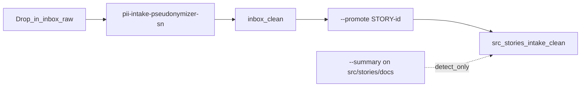

# Repo layout

Expected tree for ServiceNow-style story work. Adapt story IDs to your org (`STORY-1000`, `STRY12345`, …).

```text
repo-root/
├── inbox/
│   ├── raw/          # Quarantine: drop exports here (never commit real PII)
│   └── clean/        # This-run staging after pseudonymization (.gitkeep ok)
├── src/
│   └── stories/
│       └── STORY-1000/
│           ├── docs/           # Story markdown (commit-gate target)
│           └── intake-clean/   # Optional: promoted copies from inbox/clean
├── .local/                   # gitignored — map, manifest (never commit)
│   ├── pii-map.json
│   └── intake-manifest.json
├── config/                   # Shipped policy files
└── scripts/                  # CLI implementation
```

## Path roles

| Path | Safe for collaborators / CI? | CLI default |
|------|------------------------------|-------------|
| `inbox/raw/` | **No** — treat as hot quarantine | Default intake target |
| `inbox/clean/` | After successful write only | Default output staging |
| `src/stories/**/docs/` | Yes, after pseudonymization | `--summary` commit gate |
| `src/stories/**/intake-clean/` | Yes, when promoted | `--promote STORY-id` |
| `.local/` | **Never** commit or share | Map + manifest |

## Workflow summary



## `.gitignore` expectations

Keep `inbox/raw/` and `.local/` out of git. Only pseudonymized story paths should reach shared remotes.

## Generic alternative

If you do not use `inbox/` or `src/stories/`, use [pii-intake-pseudonymizer](https://github.com/alkitect/pii-intake-pseudonymizer) with `input/` and `output/` instead. SN uses `--promote STORY-id` instead of generic `--copy-to` — see [product comparison](product-comparison.md).
